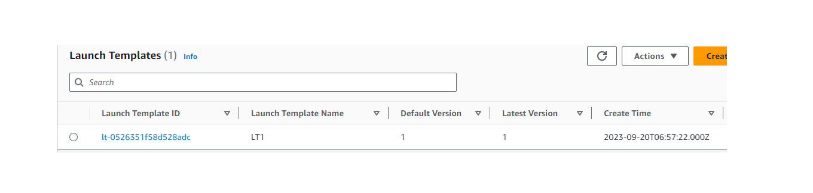
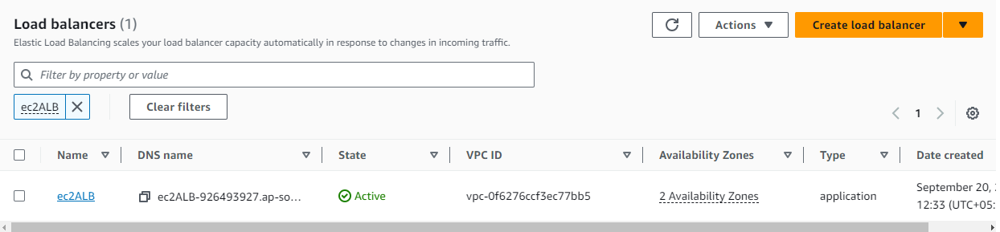
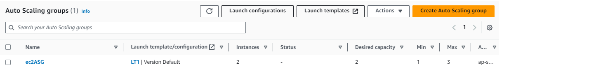
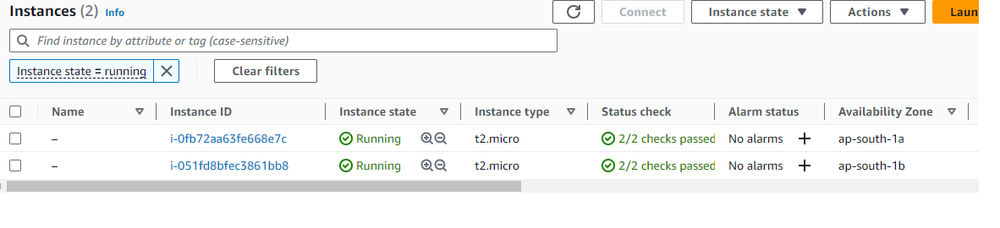
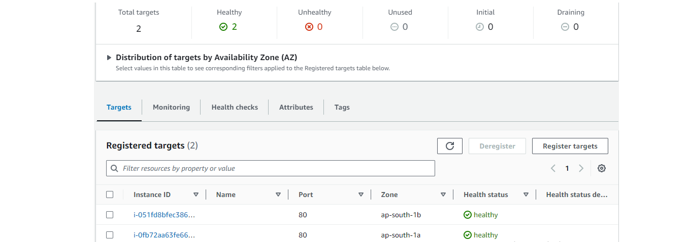

# Building Scalable application with AWS EC2

## Implementing High Availability and Scalability with AWS EC2, Elastic Load Balancer, and Auto Scaling Groups

### Steps

1. Create 2 Subnets and auto assign Public IPv4 Address 

2. Launch a Template

3. Creating a Target Group

4. Creating a Load Balancer

5. Creating a Auto Scaling Group

6. Auto Scaling Group Launched 2 Instances with Instance State Running

7. Navigate to Target Group Section and Check whether 2 Instances are healthy

8. Navigate to Load Balancer Section and Copy the DNS URL and paste in new browser tab
   ### It will display one the instance id

   ### Reload the url and it will display another instance id

