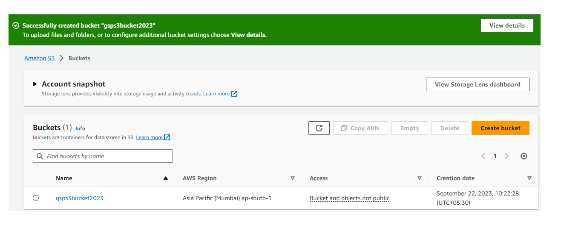
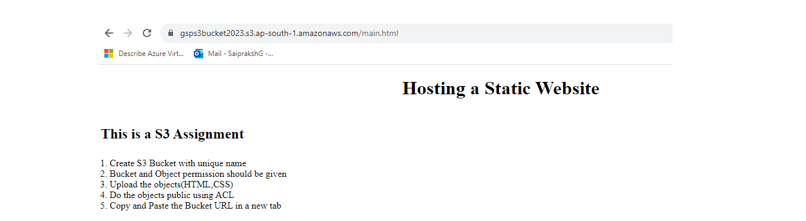

# Building a Static Website Hosting Solution with AWS S3, Versioning, and Lifecycle Policies

## Steps

1. Navigating to S3 Console and Creating a S3 Bucket with unique name

2. Give the Public Access the objects by clicking bucket name and navigating to permissions tab

3. Navigate to Objects Tab and upload the HTML and CSS files.

4. Enable the Bucket Version by navigating to properties tab

5. Enable the Static Website Hosting by navigating to Properties Tab

6. Implement an S3 bucket policy to restrict access to the website only from specific IP addresses.

7. We can give LifeCycle Rules to transition to another storage class and delete the objects after the period.
   Where LifeCyle1 is transition to S3 Glacier Deep Archive after 30 days and
   LifeCycle2 is to delete the objects after 90 days

8. Checking the Static Website either by navigating to properties tab or by clicking on first object url.

9. Checking the website by modyfying the main.html and uploading the new html file

10. Check the website again.

11. I have created with IAM user with S3 readonlyaccess.

12. Enabled Server Access Logging

