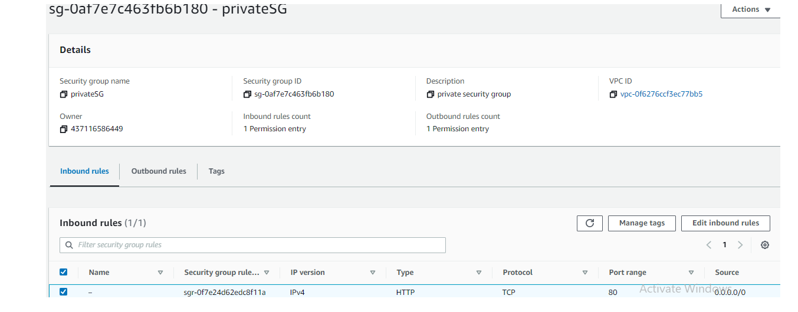
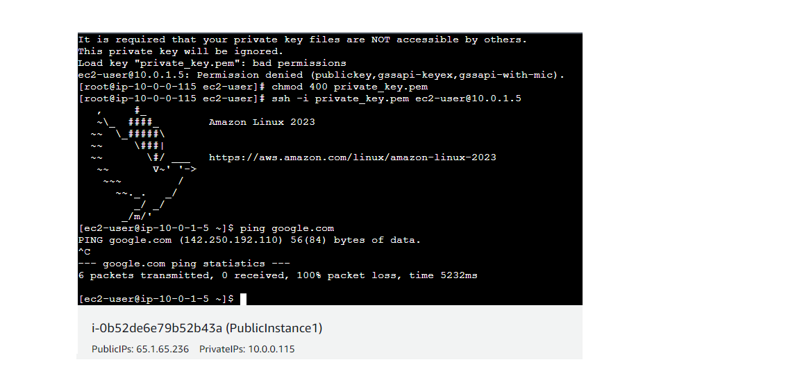

# VPC Implementation, CIDR Range, and Troubleshooting

## Part 1 : VPC Setup

### Steps

1. Creating a VPC called my-vpc-01

2. Creating Public and Private Subnets

3. Creating an Internet Gateway and attaching to vpc-01

4. Creating Route Tables for public subnets and private subnet

 
5. Configure Public Route Table to route traffic to Internet Gateway

6. Attaching Public Route Table to Public Subnets

7. Creating Security Groups for public and private instances
   and defined inbound rules for each.

## Part 2 : Instance Launch and Troubleshooting

8. Launching 2 Public Instances in 2 Public Subnets and Private Instance in Private Subnet

9. Checking each Public Instance is connecting through internet

10. Checking Private Instance is connecting through internet

11. Creating NAT Gateway and connecting to private route table

12. Private Instance is connected to Internet via NAT Gateway

# Part 3 : CIDR Range Calculation

Question : Given a requirement to accommodate 150 host addresses in a subnet, calculate the appropriate CIDR      block (prefix length) to fulfill this requirement.Provide the CIDR notation and subnet mask for the selected CIDR block.

Answer : There are 32 bits in total network
         24 bits out of 32 are locked i.e., 32-24=8 bits is used as host bits.
         2^8=256 addresses are present
         Out of 256 , 2 addresses are used as network address which is least and broadcast address which is the highest.
         For example :
         Chosen address : 10.0.0.0/24
         10.0.0 ==> These are locked, we can't change these 24 bits
         .0 ==> this last 8 bits we can use as host addresses
         (2^8)-2 = 256-2 = 254 usable host addresses
         In this 254 host addresses, 150 host addresses can be accomodated.

         CIDR notation : 10.0.0.0/24
         Subnet mask : 11111111.11111111.11111111.00000000
         Network Address : 10.0.0.0
         BroadCast Address : 10.0.0.255
         Usable Host Addresses : 10.0.0.1 to 10.0.0.254

# Part 4 : Diagram
         
# Virtual Private Cloud Flow Diagram

